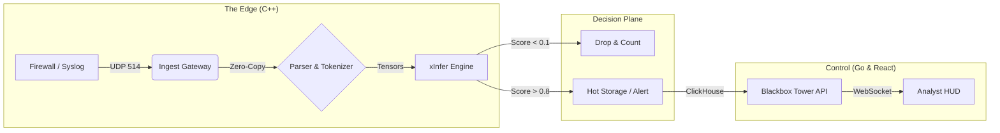

# ◼️ Blackbox
### The AI-Native Flight Recorder for Enterprise Security

[](https://github.com/ignition-ai/blackbox/actions)
[]()
[]()
[]()
[]()

> **"Truth survives the crash."**

**Blackbox** is a high-performance, inline Security Information and Event Management (SIEM) engine designed for the modern threat landscape. It functions as an indestructible network flight recorder, ingesting massive streams of telemetry, analyzing them in microseconds using embedded AI, and actively blocking threats before they penetrate the network core.

Unlike legacy SIEMs (Splunk, ELK) that rely on a "Store-First, Analyze-Later" architecture, Blackbox utilizes a **"Compute-First"** paradigm. By moving the AI inference layer directly into the ingestion pipeline, Blackbox eliminates the latency between infection and detection, transforming security from a passive log to a kinetic defense.

---

## ⚡ The Blackbox Philosophy

### 1. Speed is Security
In high-frequency trading, microseconds matter. In cybersecurity, they matter even more. Blackbox is built on a custom **C++ 20** architecture using lock-free ring buffers and SIMD-optimized parsing. It handles **100,000+ Events Per Second (EPS)** on commodity hardware with sub-millisecond latency.

### 2. Inline AI, Not Offline Analysis
Traditional AI security relies on batch processing logs hours after the event. Blackbox integrates our proprietary **`xInfer`** engine directly into the data plane. Every single log line—whether HTTP, Auth, or NetFlow—is vectorized and scored by a custom neural network in real-time.

### 3. The Signal-to-Noise Ratio
99% of security logs are noise (KeepAlives, successful handshakes). Storing them costs millions. Blackbox uses intelligent inference to differentiate "Safe" noise from "Anomalous" signals.
*   **Green Logs (Safe):** Discarded or summarized into metrics (saving ~90% storage).
*   **Red Logs (Threats):** Full-fidelity capture stored in immutable cold storage.

### 4. Air-Gap Sovereign
Blackbox is designed for defense, intelligence, and critical infrastructure. It requires **zero internet connectivity**. All AI models are trained offline in the Simulator and deployed as frozen, compiled engines. No data ever leaves your perimeter.

---

## 🏗️ System Architecture

Blackbox is structured as a **Monorepo**, ensuring tight coupling between the training environment (Sim) and the deployment environment (Core).



### 📂 Module Directory

| Module | Codename | Tech Stack | Responsibility |
| :--- | :--- | :--- | :--- |
| **`/blackbox-core`** | **Recorder** | C++ 20, CUDA, Boost | The kernel of the system. Handles network I/O, parses raw logs using SIMD, executes AI models via TensorRT, and routes data. |
| **`/blackbox-tower`** | **Tower** | Go (Golang) | The API control plane. Manages agent configuration, executes complex OLAP queries against ClickHouse, and handles authentication. |
| **`/blackbox-hud`** | **HUD** | React, TypeScript, Vite | The "Heads Up Display" for analysts. Features a virtualized log stream renderer and WebGL-based threat mapping. |
| **`/blackbox-sim`** | **Sim** | Python, PyTorch | The offline R&D lab. Used to train custom autoencoders on historical data and export optimized `.plan` files for the Core. |
| **`/blackbox-deploy`** | **Chassis** | Docker, K8s, Helm | Infrastructure definitions. Contains the ClickHouse schema optimization and Kubernetes scaling policies. |

---

## 🚀 Performance Specifications

| Metric | Specification |
| :--- | :--- |
| **Throughput** | 120,000 EPS (Single Node, 8 vCPU) |
| **Ingest Latency** | < 250 microseconds |
| **Inference Latency** | < 1.2 milliseconds (Batch Size 32) |
| **Memory Footprint** | ~400MB (Idle) |
| **Supported Protocols** | Syslog (RFC5424), TCP, UDP, HTTP JSON |
| **Storage Backend** | ClickHouse (MergeTree Engine) |

---

## 🛠️ Quick Start (Developer Mode)

### Prerequisites
*   Docker & Docker Compose (v2.0+)
*   NVIDIA Container Toolkit (Optional, for GPU support)

### 1. Clone the Monorepo
```bash
git clone https://github.com/ignition-ai/blackbox.git
cd blackbox
```

### 2. Initialize the Environment
We use a unified Make command to build the containers for the Core, API, and Web Interface.
```bash
# Builds images for blackbox-core, blackbox-tower, and blackbox-hud
make build-all
```

### 3. Launch the Stack
Spins up the entire infrastructure, including the ClickHouse database and Redis message broker.
```bash
docker-compose up -d
```

### 4. Verify Status
*   **The HUD (Dashboard):** [http://localhost:3000](http://localhost:3000)
*   **The Tower (API):** [http://localhost:8080/health](http://localhost:8080/health)
*   **The Vault (DB):** [http://localhost:8123](http://localhost:8123)

### 5. Send Test Telemetry
Simulate a "Brute Force" attack log to test the ingestion pipeline.
```bash
echo "<134>Dec 10 10:00:00 auth-server sshd[123]: Failed password for root from 192.168.1.50 port 22 ssh2" | nc -u -w1 127.0.0.1 514
```
*Check the HUD. You should see a red alert appear instantly.*

---

## 🧠 The AI Workflow (Sim to Core)

Blackbox uses a specialized workflow to ensure models trained in Python work identically in C++.

1.  **Ingest Data:** Load historical CSV/JSON logs into `/blackbox-sim/data`.
2.  **Train:** Run `python train.py --template autoencoder`. This produces a `.xt` checkpoint.
3.  **Compile:** Run `python export.py`. This fuses the layers and generates a hardware-specific `.plan` file (TensorRT Engine).
4.  **Deploy:** Move the `.plan` file to `/blackbox-core/models`. The C++ engine hot-reloads the new brain automatically.

---

## 🛣️ Roadmap

*   **v0.1 (Alpha):** Core ingestion, Regex parsing, ClickHouse storage. (✅ Completed)
*   **v0.5 (Beta):** `xInfer` integration, Basic Anomaly Detection, React HUD.
*   **v1.0 (GA):** Distributed Agents, Enterprise SSO, RBAC.
*   **v2.0 (Sovereign):** Hardware appliance support (FPGA offloading).

---

## 🤝 Contributing

This is a proprietary codebase managed by **Ignition AI**.
However, we welcome contributions to the open-source SDKs located in `libs/`.

1.  Fork the Project
2.  Create your Feature Branch (`git checkout -b feature/AmazingFeature`)
3.  Commit your Changes (`git commit -m 'Add some AmazingFeature'`)
4.  Push to the Branch (`git push origin feature/AmazingFeature`)
5.  Open a Pull Request

---

## 📄 License

**Proprietary & Confidential.**
Unauthorized copying of this file, via any medium, is strictly prohibited.
Copyright © 2025 Ignition AI. All Rights Reserved.