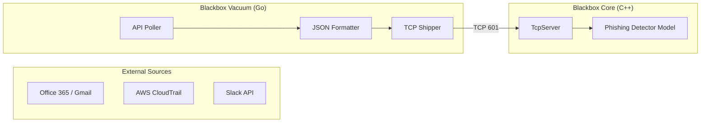

To extend a SIEM to ingest **Emails** (Office 365, Gmail), **SaaS Logs** (Slack, Salesforce), or **Cloud Logs** (AWS, Azure), you face a structural problem:

The **Blackbox Core** (C++) is designed for **Push** traffic (receiving data sent to it).
Emails and APIs operate on **Pull** traffic (you must login and ask for data).

You should **not** write IMAP or OAuth2 logic in C++. It is painful and hard to maintain.

Instead, you create a new module called **`blackbox-vacuum`**.

---

### **The Architecture: "Blackbox Vacuum"**

**Role:** The Aggregator.
**Tech Stack:** **Go (Golang)** or **Python**.
**Responsibility:**
1.  Connects to external APIs/Mailboxes.
2.  Fetches new items.
3.  Normalizes them into a standard JSON format.
4.  **Pushes** them to `blackbox-core` via TCP (Port 601).



---

### **1. Implementation: The Email Collector**

We will build a **Go service** that checks an inbox via IMAP (universal) or Graph API, converts the email to a log line, and sends it to the Core.

**File:** `blackbox-vacuum/collectors/email_poller.go`

```go
package collectors

import (
	"fmt"
	"log"
	"net"
	"strings"
	"time"

	"github.com/emersion/go-imap"
	"github.com/emersion/go-imap/client"
)

type EmailConfig struct {
	Server   string
	Port     string
	User     string
	Password string
}

// Connects to Email, fetches unread, sends to Core
func PollEmails(cfg EmailConfig, coreConn net.Conn) {
	log.Println("Connecting to Email Server...")
	c, err := client.DialTLS(cfg.Server + ":" + cfg.Port, nil)
	if err != nil {
		log.Printf("Email Connect Error: %v", err)
		return
	}
	defer c.Logout()

	if err := c.Login(cfg.User, cfg.Password); err != nil {
		log.Printf("Email Login Error: %v", err)
		return
	}

	// Select INBOX
	mbox, err := c.Select("INBOX", false)
	if err != nil {
		log.Printf("Select Inbox Error: %v", err)
		return
	}

	// Fetch Unread
	criteria := imap.NewSearchCriteria()
	criteria.WithoutFlags = []string{imap.SeenFlag}
	uids, _ := c.Search(criteria)

	if len(uids) == 0 {
		return // No new emails
	}

	seqset := new(imap.SeqSet)
	seqset.AddNum(uids...)
	items := []imap.FetchItem{imap.FetchEnvelope}

	messages := make(chan *imap.Message, 10)
	go func() {
		c.Fetch(seqset, items, messages)
	}()

	for msg := range messages {
		// 1. Extract Features for SIEM
		subject := msg.Envelope.Subject
		sender := msg.Envelope.From[0].Address()
		
		// 2. Format as a Log Line (JSON)
		// We verify this is an "EMAIL" source
		logLine := fmt.Sprintf(`{"source": "email", "from": "%s", "subject": "%s", "ts": %d}`+"\n", 
			escape(sender), escape(subject), time.Now().Unix())

		// 3. Send to Blackbox Core
		coreConn.Write([]byte(logLine))
		
		log.Printf("Forwarded Email: %s", subject)
	}
}

func escape(s string) string {
	return strings.ReplaceAll(s, "\"", "\\\"")
}
```

---

### **2. Extending `blackbox-core` to Detect Phishing**

Now that emails are arriving at the C++ Core via TCP, you need to analyze them. Phishing detection requires looking at **Language** (Urgency) and **Links**.

**Step 1: Update `ParserEngine.cpp`**
Handle the JSON format from the Vacuum.

```cpp
// Inside process()
if (common::StringUtils::starts_with(msg, "{")) {
    // It's JSON (likely from Vacuum)
    auto json = parse_json(msg); 
    if (json["source"] == "email") {
        output.service = "email_gateway";
        output.host = json["from"]; // Treat Sender as Host
        output.message = json["subject"]; // Analyze Subject Line
    }
}
```

**Step 2: Train a "Phishing BERT" Model**
In `blackbox-sim`, you need a new model. The Autoencoder (numeric) is bad at text. You need an NLP model.

**Dataset:** [Phishing Email Dataset (Kaggle)](https://www.kaggle.com/datasets/naraen/phishing-email-dataset)

**Model:** Fine-tune **DistilBERT** (HuggingFace) to classify "Safe" vs "Phish".

**Execution:**
1.  Train DistilBERT in Python.
2.  Export to ONNX.
3.  Load in C++ `InferenceEngine`.

---

### **3. Integrating "Other Things" (The Universal Connector)**

To connect **Slack**, **AWS**, or **Salesforce**, you use the **Webhook Strategy**.

Instead of writing a poller for every service, you let the services call you.

**File:** `blackbox-vacuum/webhook_server.go`

```go
package main

import (
	"fmt"
	"io"
	"net"
	"net/http"
)

var coreConn net.Conn

func handleSlackWebhook(w http.ResponseWriter, r *http.Request) {
	body, _ := io.ReadAll(r.Body)
	
	// Convert Slack JSON to Blackbox Log
	// Slack sends: {"event": {"text": "Hello", "user": "U123"}}
	
	logLine := fmt.Sprintf("SLACK_MSG: %s\n", string(body))
	
	// Push to C++ Core
	coreConn.Write([]byte(logLine))
	
	w.WriteHeader(200)
}

func main() {
    // Connect to C++ Core TCP
	var err error
	coreConn, err = net.Dial("tcp", "blackbox-core:601")
	if err != nil {
		panic(err)
	}

	http.HandleFunc("/hooks/slack", handleSlackWebhook)
	http.HandleFunc("/hooks/aws-sns", handleAwsWebhook)
	
	http.ListenAndServe(":9090", nil)
}
```

---

### **Summary of the Strategy**

1.  **Do not pollute the C++ Core** with HTTP libraries or API SDKs. Keep the Core fast and dumb (streams only).
2.  **Create `blackbox-vacuum`** (Go/Python) to handle the complex "Pulling" and "API Handshakes".
3.  **Normalize data** in the Vacuum into a simple text/JSON line.
4.  **Send to Core** via the existing TCP port 601.

**Result:** Your C++ Core now "sees" emails and Slack messages just like it sees system logs, and applies the same high-speed AI to them.