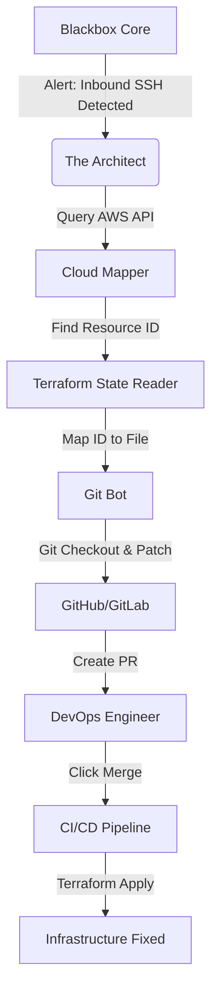

This is one of the most ambitious and high-value features you can build. It moves Blackbox from **"Telling you you're open"** to **"Closing the door for you."**

In the industry, this is often called **CSPM (Cloud Security Posture Management)** combined with **GitOps**.

Here is the deep dive into **"The Architect" (Self-Healing Infrastructure)**.

---

### **1. The Core Philosophy**

Modern infrastructure is defined as code (Terraform, CloudFormation, Kubernetes YAML).
*   **The Attack:** A developer accidentally commits a Terraform file allowing `0.0.0.0/0` (Open Internet) on Port 22 (SSH).
*   **The Detection:** Blackbox Core sees traffic on Port 22.
*   **The Old Way:** Analyst calls the developer -> Developer finds the file -> Developer patches it -> Deploys. (Time: 4 hours).
*   **The Self-Healing Way:** Blackbox finds the exact line of code in GitHub, edits it to restrict IP ranges, and opens a Pull Request. (Time: 4 seconds).

---

### **2. The Architecture**

You need a new microservice in `blackbox-tower` or a standalone Go service called **`blackbox-architect`**.



---

### **3. Technical Implementation Steps**

To make this work, you need to solve the **"Traceability Problem"**: How do we map a running IP address back to a line of code in a Git repo?

#### **Step A: The Cloud Mapper (Tagging Strategy)**
Your infrastructure *must* use tags. You can enforce this via policy or assume standard GitOps tagging.

*   **AWS Resource Tag:** `iac-repo: my-org/infrastructure`, `iac-path: /prod/security-groups.tf`
*   **Architect Logic:**
    1.  Alert comes in for Instance `i-0123456789`.
    2.  Architect queries AWS API: `GetTags(i-0123456789)`.
    3.  It finds the Repo URL and File Path.

#### **Step B: The State Reader**
If tags aren't perfect, you parse the **Terraform State File** (`terraform.tfstate`). This JSON file maps logical names to physical IDs.

#### **Step C: The "Patch Generator"**
This is where you use **Regex** or **LLMs**.

*   **Deterministic Patching (Safer):** Use libraries like `hclwrite` (Go) to parse Terraform HCL, find the `ingress` block, and replace `cidr_blocks`.
*   **Generative Patching (Smarter):** Send the Terraform snippet to a local CodeLlama model with the prompt: *"Restrict ingress port 22 to internal VPN only."*

---

### **4. Code Example: The Git Fixer**

Here is a Go implementation for **`blackbox-architect/git_fixer.go`**. It uses the GitHub API to fix a security group automatically.

**Dependencies:** `go get github.com/google/go-github/v50/github`

```go
package architect

import (
	"context"
	"fmt"
	"strings"

	"github.com/google/go-github/v50/github"
	"golang.org/x/oauth2"
)

type Fixer struct {
	Client *github.Client
	Owner  string
	Repo   string
}

func NewFixer(token, owner, repo string) *Fixer {
	ts := oauth2.StaticTokenSource(&oauth2.Token{AccessToken: token})
	tc := oauth2.NewClient(context.Background(), ts)
	return &Fixer{Client: tc, Owner: owner, Repo: repo}
}

// CreateSecurityFixPR downloads a file, patches it, and opens a PR
func (f *Fixer) CreateSecurityFixPR(filePath string, badCidr string, safeCidr string) error {
	ctx := context.Background()

	// 1. Get Current File Content
	fileContent, _, _, err := f.Client.Repositories.GetContents(ctx, f.Owner, f.Repo, filePath, nil)
	if err != nil {
		return err
	}

	contentStr, _ := fileContent.GetContent()

	// 2. Apply The Fix (Simple String Replacement for MVP)
	// In production, use an HCL parser (hashicorp/hcl)
	if !strings.Contains(contentStr, badCidr) {
		return fmt.Errorf("could not find vulnerable CIDR in file")
	}
	newContent := strings.Replace(contentStr, badCidr, safeCidr, 1)

	// 3. Create a New Branch
	baseBranch := "main"
	newBranch := "security-fix-ssh-" + fmt.Sprint(time.Now().Unix())
	
	ref, _, _ := f.Client.Git.GetRef(ctx, f.Owner, f.Repo, "refs/heads/"+baseBranch)
	f.Client.Git.CreateRef(ctx, f.Owner, f.Repo, &github.Reference{
		Ref: github.String("refs/heads/" + newBranch),
		Object: &github.GitObject{SHA: ref.Object.SHA},
	})

	// 4. Commit Changes
	msg := "fix(security): Restrict SSH access to internal VPN"
	opts := &github.RepositoryContentFileOptions{
		Message: &msg,
		Content: []byte(newContent),
		Branch:  &newBranch,
		SHA:     fileContent.SHA,
	}
	f.Client.Repositories.UpdateFile(ctx, f.Owner, f.Repo, filePath, opts)

	// 5. Open Pull Request
	prTitle := "[Blackbox] Security Fix: Close Open SSH Port"
	prBody := "Blackbox detected traffic on Port 22 from the public internet.\n\nThis PR restricts access to the corporate VPN CIDR."
	
	newPR := &github.NewPullRequest{
		Title: &prTitle,
		Body:  &prBody,
		Head:  &newBranch,
		Base:  &baseBranch,
	}
	
	_, _, err = f.Client.PullRequests.Create(ctx, f.Owner, f.Repo, newPR)
	return err
}
```

---

### **5. Use Cases for Self-Healing**

#### **Case 1: The "Open S3 Bucket"**
*   **Detection:** `Vacuum` polls AWS CloudTrail and sees `PutBucketAcl` with `public-read`.
*   **Architect:** Locates the Terraform file defining `aws_s3_bucket`.
*   **Fix:** Changes `acl = "public-read"` to `acl = "private"`.
*   **Result:** PR created instantly.

#### **Case 2: The "Vulnerable Container Image"**
*   **Detection:** `Sentry` runs SBOM and sees `log4j-2.14.jar` inside a Docker container.
*   **Architect:** Finds the `Dockerfile` in the repo.
*   **Fix:** Updates `FROM tomcat:8.0` to `FROM tomcat:9.0-jdk17`.
*   **Result:** PR created. When merged, CI/CD redeploys a clean container.

#### **Case 3: "Configuration Drift"**
*   **Detection:** Someone manually changed a Security Group in the AWS Console (bypassing Terraform) to open Port 8080.
*   **Architect:** Detects the diff between `Running State` and `Git Code`.
*   **Fix:** Re-runs `terraform apply` to overwrite the manual change and enforce the code configuration.

---

### **Safety Mechanisms (Critical)**

You cannot let a bot edit infrastructure blindly. You need **Guardrails**:

1.  **Pull Request Only:** Never commit directly to `main`. Always create a PR. This forces a human to review and click "Merge."
2.  **Confidence Score:** Only trigger the Architect if the Detection Confidence is > 99%.
3.  **Rate Limiting:** Prevent the bot from opening 100 PRs in 1 minute (Loop prevention).

### **Why this sells**

This feature changes the conversation with C-Level executives:
*   **Without Architect:** "Blackbox tells us we have problems." (Creates work).
*   **With Architect:** "Blackbox fixes our problems." (Removes work).

This is the ultimate evolution of **DevSecOps**.