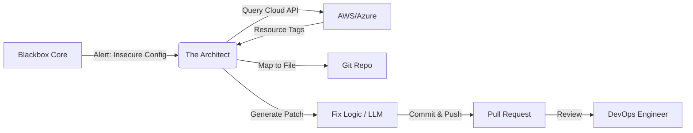

Here is the standalone **README.md** for the **`blackbox-architect`** module.

Place this file at **`blackbox/blackbox-architect/README.md`**.

***

```markdown
# 🏗️ Blackbox Architect
### Self-Healing Infrastructure & Automated Remediation

[]()
[]()
[]()

**Blackbox Architect** is the "Self-Healing" module of the Blackbox ecosystem. While the Core detects attacks, the Architect fixes the root cause.

It bridges the gap between **Runtime Security** and **Infrastructure as Code (IaC)**. When a cloud vulnerability is detected (e.g., an open Security Group), Architect locates the specific Terraform/Ansible file in your Git repository that defined it, generates a patch, and opens a Pull Request to fix it.

---

## ⚡ Key Capabilities

### 1. Cloud-to-Code Mapping
It traces a running cloud resource (e.g., AWS Instance ID `i-012345`) back to the specific line of code in your Git repository (e.g., `main.tf:45`) using state file analysis and resource tagging.

### 2. Automated Remediation (GitOps)
Instead of just sending an alert, Architect proposes a fix.
*   **Detection:** "Port 22 is open to the world."
*   **Action:** Creates a new Git branch, modifies the Terraform `ingress` block to restrict CIDR, and opens a Pull Request.

### 3. AI-Assisted Patching
Integrates with local LLMs (CodeLlama/DeepSeek) or heuristic engines (`hclwrite`) to intelligently rewrite insecure configuration blocks without breaking syntax.

### 4. Guardrails & Policy
Ensures safety by never auto-merging. It strictly operates via Pull Requests, requiring human review before infrastructure changes are applied.

---

## 🏗️ Workflow



---

## 🛠️ Build Instructions

### Prerequisites
*   Go 1.21+
*   Access to a Git Provider (GitHub/GitLab)
*   Cloud Credentials (AWS/Azure)

### Local Build
```bash
go mod tidy
go build -o architect cmd/architect/main.go
./architect
```

### Docker Build
```bash
docker build -t blackbox-architect .
```

---

## ⚙️ Configuration

Architect is configured via Environment Variables to ensure secrets are not hardcoded.

| Variable | Description | Required |
| :--- | :--- | :--- |
| `ARCHITECT_REDIS_HOST` | Redis host to listen for alerts from Core. | Yes |
| `GITHUB_TOKEN` | Personal Access Token (PAT) with repo write scope. | Yes |
| `GITHUB_OWNER` | Organization or User name. | Yes |
| `GITHUB_REPO` | Target Infrastructure Repository. | Yes |
| `AWS_REGION` | AWS Region for cloud resource lookup. | No (If using AWS) |
| `LLM_ENDPOINT` | URL for CodeLlama (e.g., `http://localhost:11434` for Ollama). | No (Optional) |

---

## 🚀 Usage Example

### 1. Start the Service
```bash
export GITHUB_TOKEN="ghp_xxxxxxxxxxxx"
export GITHUB_OWNER="my-org"
export GITHUB_REPO="terraform-infra"
./architect
```

### 2. Trigger a Simulation
You can manually simulate a trigger to test the GitOps flow.

```bash
# Simulates a detection of an open SSH port on an AWS Security Group
curl -X POST http://localhost:9095/simulate \
     -d '{"resource_id": "sg-0123456789", "issue": "OPEN_SSH_0.0.0.0/0"}'
```

### 3. Result
1.  Architect clones `terraform-infra`.
2.  It scans `.tf` files for `sg-0123456789` or matching tags.
3.  It finds:
    ```hcl
    ingress {
      from_port = 22
      cidr_blocks = ["0.0.0.0/0"] # <--- BAD
    }
    ```
4.  It changes it to `["10.0.0.0/8"]` (Internal Network).
5.  Check your GitHub: A new PR titled **"Security Fix: Restrict SSH Access"** will appear.

---

## 📂 Project Structure

```text
internal/
├── listener/      # Redis consumer for alerts
├── mapping/       # Logic to find code from cloud IDs
├── patcher/       # HCL/YAML code rewriting logic
├── providers/     # AWS, GitHub, GitLab API clients
└── llm/           # Client for AI code generation
```

---

## 📄 License

**Proprietary & Confidential.**
Copyright © 2025 Ignition AI. All Rights Reserved.
```