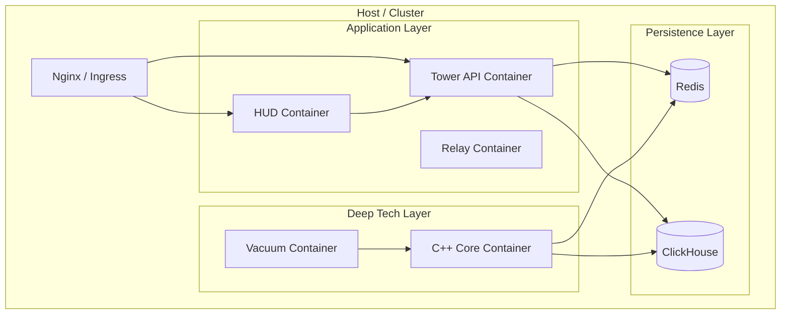

# 📦 Blackbox Deploy
### Infrastructure Orchestration & Database Management

[]()
[]()
[]()

**Blackbox Deploy** is the infrastructure "Chassis" of the platform. It contains the Infrastructure-as-Code (IaC) definitions required to spin up the entire distributed system (Core, API, UI, Agents, and Databases) in a cohesive environment.

It supports two modes of operation:
1.  **Docker Compose:** For local development, testing, and single-node deployments.
2.  **Kubernetes (Manifests):** For high-availability enterprise production deployments.

---

## 🏗️ Deployment Topology

The deployment orchestrates the following network topology:



---

## 🛠️ Docker Compose (Quick Start)

This is the standard way to run Blackbox for testing and demos.

### Prerequisites
*   Docker Engine 20.10+
*   Docker Compose v2+
*   Make

### Commands

**1. Build the Stack**
Compiles all sub-projects (C++, Go, React) into Docker images.
```bash
make build
```

**2. Start Services**
Launches the stack in detached mode.
```bash
make up
```

**3. View Logs**
Tail the logs of all services to ensure health.
```bash
make logs
```

**4. Stop Services**
```bash
make down
```

---

## 🗄️ Database Schema (ClickHouse)

Blackbox uses **ClickHouse** for high-volume log storage. The schema definitions are located in `database/clickhouse/schema/`.

### Key Tables

| Table | Engine | Description |
| :--- | :--- | :--- |
| `sentry.logs` | `MergeTree` | The main event log. Partitioned by Day. ZSTD compressed. |
| `sentry.stats` | `AggregatingMergeTree` | Materialized view for fast dashboard metrics (EPS, Threats). |
| `sentry.agents`| `ReplacingMergeTree` | Registry of active Sentry agents and their heartbeat status. |

### Auto-Initialization
When the ClickHouse container starts, it mounts the `schema/` directory to `/docker-entrypoint-initdb.d/`. All SQL files are executed automatically on the first run.

---

## ☸️ Kubernetes (Enterprise)

For production scaling, use the manifests located in `k8s/`.

```bash
# Example: Deploying to a cluster
kubectl apply -f k8s/namespace.yaml
kubectl apply -f k8s/secrets.yaml
kubectl apply -f k8s/data-layer/  # Redis & ClickHouse
kubectl apply -f k8s/app-layer/   # Core, Tower, HUD
```

### Scaling Strategy
*   **Blackbox Core:** Deployed as a `DaemonSet` (one per node) or `Deployment` with Horizontal Pod Autoscaler (HPA) based on CPU usage.
*   **ClickHouse:** Deployed as a `StatefulSet` with Persistent Volume Claims (PVC).

---

## ⚙️ Service Configuration

The stack exposes the following ports on the host machine:

| Service | Port | Protocol | Purpose |
| :--- | :--- | :--- | :--- |
| **HUD** | `3000` | HTTP | The Web Dashboard (User Interface). |
| **Tower** | `8080` | HTTP/WS | REST API and WebSocket Stream. |
| **Core** | `514` | UDP | Syslog Ingestion. |
| **Core** | `601` | TCP | Reliable Log Ingestion. |
| **Core** | `2055` | UDP | NetFlow/IPFIX Ingestion. |
| **Core** | `8081` | HTTP | Prometheus Metrics & Health Check. |
| **ClickHouse** | `8123` | HTTP | Database SQL Interface. |

---

## 📂 Directory Structure

```text
blackbox-deploy/
├── Makefile                   # Shortcut commands
├── compose/
│   └── docker-compose.yml     # Local deployment definition
├── database/
│   └── clickhouse/
│       ├── config/            # DB Tuning (users.xml)
│       └── schema/            # SQL Init scripts (01_logs.sql)
├── k8s/                       # Kubernetes Manifests
│   ├── app-layer/             # Stateless apps
│   └── data-layer/            # Stateful DBs
└── scripts/
    └── init_db.sh             # Manual DB init helper
```

---

## 📄 License

**Proprietary & Confidential.**
Copyright © 2025 Ignition AI. All Rights Reserved.
