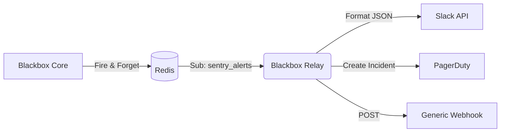

# ⚡ Blackbox Relay
### Security Orchestration, Automation, and Response (SOAR)

[]()
[]()
[]()

**Blackbox Relay** is the automation engine of the platform. It closes the loop between **Detection** and **Notification**.

While the C++ Core detects threats in microseconds, it cannot be burdened with slow HTTP API calls to external services. The Core "fires and forgets" alerts into Redis, and **Relay** picks them up to execute downstream workflows (sending Slack messages, creating Jira tickets, or triggering PagerDuty incidents).

---

## ⚡ Key Capabilities

### 1. Asynchronous Alerting
Decouples detection from notification. Even if the Slack API is down or slow, the Core Engine keeps processing network traffic at full speed without blocking.

### 2. Multi-Channel Support
Out-of-the-box integrations for:
*   **Slack:** Richly formatted message attachments with color-coded severity.
*   **PagerDuty:** Triggers incidents for high-criticality threats.
*   **Webhooks:** Generic JSON POST to arbitrary endpoints (e.g., Zapier, Tines).

### 3. Severity Routing
Configurable logic to prevent alert fatigue:
*   **Info/Low:** Log to database only (or send to a low-priority Slack channel).
*   **Medium/High:** Send to main Slack channel.
*   **Critical:** Trigger PagerDuty and SMS.

---

## 🏗️ Architecture



---

## 🛠️ Setup & Build

### Prerequisites
*   Go 1.21+
*   A running Redis instance

### 1. Environment Setup
Run the helper script to initialize the module and download dependencies.

```bash
./setup_relay.sh
```

### 2. Local Execution
```bash
# Set environment variables (see Configuration)
export REDIS_HOST=localhost
export SLACK_WEBHOOK_URL="https://hooks.slack.com/services/..."

# Run
go run cmd/relay/main.go
```

### 3. Docker Build
```bash
docker build -t blackbox-relay .
```

---

## ⚙️ Configuration

Relay is configured via Environment Variables.

| Variable | Required | Description |
| :--- | :--- | :--- |
| `REDIS_HOST` | Yes | Hostname of the Redis server (default: `localhost`). |
| `REDIS_PORT` | No | Redis port (default: `6379`). |
| `SLACK_WEBHOOK_URL` | No | Full URL for Incoming Webhook integration. |
| `PAGERDUTY_KEY` | No | Integration Key (Routing Key) for PagerDuty V2 Events. |
| `JIRA_URL` | No | Base URL for Jira instance (for ticket creation). |

---

## 📂 Project Structure

```text
blackbox-relay/
├── cmd/
│   └── relay/
│       └── main.go            # Entry Point
├── internal/
│   ├── config/                # Environment variable loader
│   ├── queue/                 # Redis Subscriber implementation
│   └── integrations/          # API Clients
│       ├── slack.go           # Slack payload formatting
│       └── pagerduty.go       # PagerDuty event triggering
├── setup_relay.sh             # Dependencies install script
└── Dockerfile                 # Production container build
```

---

## 📝 Example Payload (Redis)

The Core sends alerts to the `sentry_alerts` channel in this format:

```json
{
  "ts": 1702377200,
  "ip": "192.168.1.50",
  "score": 0.98,
  "reason": "AI Anomaly Detection",
  "country": "US",
  "msg": "SSH Brute Force detected: 50 failures in 1s"
}
```

---

## 📄 License

**Proprietary & Confidential.**
Copyright © 2025 Ignition AI. All Rights Reserved.
