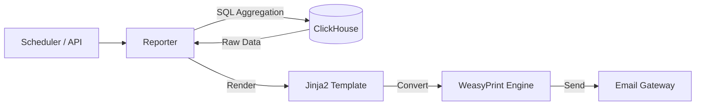

Here is the standalone **README.md** for the **`blackbox-reporter`** module.

Place this file at **`blackbox/blackbox-reporter/README.md`**.

***

```markdown
# 📄 Blackbox Reporter
### Automated Compliance & Executive Reporting

[]()
[]()
[]()

**Blackbox Reporter** is the compliance engine of the platform. It translates millions of raw logs and security alerts stored in ClickHouse into human-readable, professional PDF reports.

It is designed to solve the "Audit Problem." Instead of manually taking screenshots of dashboards, Reporter automatically generates **PCI-DSS**, **HIPAA**, and **Executive Summary** reports on a scheduled basis and emails them to stakeholders.

---

## ⚡ Key Capabilities

### 1. Compliance-as-Code
Includes pre-built templates mapping technical events to compliance controls.
*   **PCI-DSS 10.2:** "Verify all individual access to cardholder data is logged."
*   **HIPAA:** "Report on unauthorized access attempts to ePHI."

### 2. High-Fidelity Rendering
Uses **Jinja2** for templating and **WeasyPrint** for rendering, allowing pixel-perfect PDF generation with embedded vector charts (via Matplotlib/Plotly) and branding.

### 3. Automated Delivery
*   **Scheduled:** Run monthly, weekly, or daily via internal cron.
*   **On-Demand:** Triggerable via API for ad-hoc investigations.
*   **Delivery:** Sends via SMTP (Email) or uploads to S3 Secure Buckets for long-term retention.

---

## 🏗️ Architecture



---

## 🛠️ Setup & Build

### Prerequisites
*   Python 3.10+
*   ClickHouse Database access
*   System libraries for PDF generation (`libcairo2`, `libpango`)

### 1. Local Installation
```bash
# Install system dependencies (Linux)
sudo apt-get install build-essential python3-dev python3-pip python3-setuptools python3-wheel python3-cffi libcairo2 libpango-1.0-0 libpangocairo-1.0-0 libgdk-pixbuf2.0-0 libffi-dev shared-mime-info

# Install Python requirements
pip install -r requirements.txt
```

### 2. Docker Build
The Dockerfile includes all heavy OS dependencies required for PDF rendering.

```bash
docker build -t blackbox-reporter .
```

---

## 🚀 Usage

### Generate a Report Manually
```bash
# Set DB Connection
export CLICKHOUSE_HOST=localhost

# Generate Executive Summary for the last 30 days
python src/main.py --report executive --days 30 --output report.pdf
```

### Run as a Service (Scheduler)
```bash
# Runs the cron loop defined in config
python src/main.py --daemon
```

---

## ⚙️ Configuration

Configuration is handled via Environment Variables.

| Variable | Description | Default |
| :--- | :--- | :--- |
| `CLICKHOUSE_HOST` | Database Hostname | `localhost` |
| `SMTP_SERVER` | Mail Server for delivery | - |
| `SMTP_USER` | Mail User | - |
| `SMTP_PASS` | Mail Password | - |
| `REPORT_SCHEDULE` | Cron expression | `0 8 1 * *` (Monthly) |
| `COMPANY_LOGO_URL` | URL for header logo | - |

---

## 📂 Project Structure

```text
blackbox-reporter/
├── requirements.txt           # Python Deps (jinja2, weasyprint, clickhouse-driver)
├── Dockerfile                 # Container with PDF libs
├── src/
│   ├── main.py                # Entry Point
│   ├── database/
│   │   └── clickhouse.py      # Aggregation Queries
│   ├── rendering/
│   │   ├── pdf_engine.py      # HTML to PDF conversion
│   │   └── charts.py          # Matplotlib image generation
│   └── delivery/
│       └── email_sender.py    # SMTP logic
└── templates/                 # HTML/CSS Report Designs
    ├── base.html
    ├── executive_summary.html
    ├── pci_dss_compliance.html
    └── incident_postmortem.html
```

---

## 📄 Example Report Content

A typical **Executive Summary** includes:
1.  **Threat Score:** 0-100 Health Rating.
2.  **Attack Volume:** Total attacks blocked vs. attempted.
3.  **Top Attackers:** World map visualization of source IPs.
4.  **Response Time:** Average time (MTTR) to resolve alerts.

---

## 📄 License

**Proprietary & Confidential.**
Copyright © 2025 Ignition AI. All Rights Reserved.
```