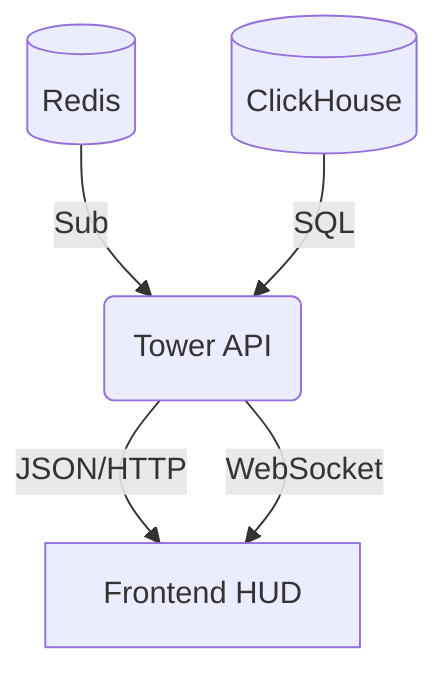

# 🗼 Blackbox Tower
### API Gateway & Control Plane

[]()
[]()
[]()

**Blackbox Tower** is the central control plane and API gateway for the Blackbox ecosystem. While the C++ Core handles high-velocity ingestion, Tower provides the logic layer required for human interaction.

It acts as the bridge between the raw data stored in ClickHouse, the real-time alerts flowing through Redis, and the visual dashboard (HUD).

---

## ⚡ Key Capabilities

### 1. Real-Time Telemetry Bridge
*   **Redis to WebSocket:** Subscribes to the high-speed `sentry_alerts` channel from the C++ Core and broadcasts events to connected frontend clients via WebSockets.
*   **Latency:** Delivers alerts from the kernel to the analyst's screen in sub-millisecond timeframes.

### 2. Historical Investigation
*   **ClickHouse Integration:** Translates REST API filters (time ranges, IPs, service names) into optimized SQL queries for the columnar database.
*   **Aggregated Stats:** Computes Events Per Second (EPS) and threat distribution metrics on the fly.

### 3. Identity & Access
*   **Authentication:** Issues and validates JWTs (JSON Web Tokens) for secure access.
*   **RBAC:** Enforces role-based access control (Admin vs. Viewer) for API endpoints.

---

## 🏗️ Architecture



---

## 🛠️ Build Instructions

### Prerequisites
*   Go 1.21+
*   Running instances of Redis and ClickHouse (or use Docker Compose)

### 1. Local Development
```bash
# Install dependencies
go mod tidy

# Run the server
go run cmd/atc-server/main.go
```
*Server listens on port `8080` by default.*

### 2. Docker Build
Produces a lightweight Alpine-based container.

```bash
docker build -t blackbox-tower .
```

---

## ⚙️ Configuration

Configuration is managed via Environment Variables.

| Variable | Default | Description |
| :--- | :--- | :--- |
| `TOWER_PORT` | `8080` | HTTP listening port. |
| `BLACKBOX_CLICKHOUSE_URL` | `tcp://localhost:9000` | Database connection string. |
| `BLACKBOX_REDIS_HOST` | `localhost` | Redis hostname. |
| `BLACKBOX_REDIS_PORT` | `6379` | Redis port. |
| `JWT_SECRET` | `change_me` | Secret key for signing tokens. |

---

## 🔌 API Endpoints

### Authentication
*   `POST /api/v1/login`
    *   **Body:** `{"username": "...", "password": "..."}`
    *   **Returns:** Bearer Token

### Telemetry (Protected)
*   `GET /logs`
    *   **Query Params:** `limit`, `offset`, `search`
    *   **Returns:** JSON array of historical logs.
*   `GET /stats`
    *   **Returns:** Total logs, Threat count, current EPS.

### Real-Time
*   `GET /ws`
    *   **Upgrade:** WebSocket
    *   **Stream:** Pushes live JSON log objects.

### Ops
*   `GET /api/v1/health`
    *   **Returns:** `200 OK` if DB/Redis connections are healthy.

---

## 📂 Project Structure

```text
blackbox-tower/
├── cmd/
│   └── atc-server/
│       └── main.go            # Entry Point
├── internal/
│   ├── api/
│   │   ├── handlers/          # HTTP Endpoint Logic (Auth, Query)
│   │   ├── middleware/        # CORS, JWT Validation
│   │   └── router.go          # Gin Route definitions
│   ├── config/                # Env Var Loader
│   ├── storage/               # ClickHouse & Redis Repositories
│   └── websocket/             # Hub & Client connection manager
├── pkg/
│   └── models/                # Shared Structs (LogEntry, Stats)
├── Dockerfile                 # Production Build
└── go.mod                     # Dependencies
```

---

## 📄 License

**Proprietary & Confidential.**
Copyright © 2025 Ignition AI. All Rights Reserved.
